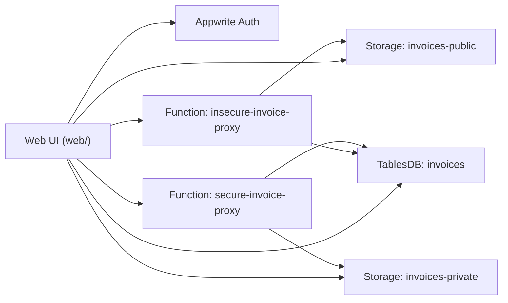

# Appwrite IDOR/BOLA Lab

Bu repository, vize konusu olarak secilen `Rol Karmasasi (IDOR / BOLA)` basligini Appwrite uzerinde hem teorik analiz hem de calisan laboratuvar olarak teslim etmek icin hazirlandi. Yani repo sadece dokuman degil; Appwrite kaynaklarini kuran script'ler, iki farkli Function akisi, web arayuzu, GitHub Actions ve akademik analiz belgeleri ayni yerde bulunur.

## Bu repo neyi gosteriyor?

- `insecure bucket` modeli: dosya bucket seviyesinde genis `Role.users()` okuma izniyle tutulursa, sadece `fileId` bilen herhangi bir oturum dogrudan icerige ulasabilir.
- `insecure proxy` modeli: sunucu tarafinda gelen `invoiceId` degerine guvenilip admin yetkili dynamic API key ile row ve file okunursa klasik IDOR/BOLA dogar.
- `secure proxy` modeli: Function, kullanici JWT'si ile Appwrite'a baglanir; row permission + `ownerUserId` birlikte dogrulanir.

## Mimari



## Repo Haritasi

- `web/`: kayit, giris, fatura olusturma, saldiri paneli ve sonuc karsilastirmasi
- `functions/insecure-invoice-proxy/`: kasitli zafiyetli Appwrite Function
- `functions/secure-invoice-proxy/`: ownership kontrolu yapan guvenli Function
- `scripts/bootstrap-lab.mjs`: database, table, column, index ve bucket kurulum script'i
- `scripts/reset-lab.mjs`: lab kaynaklarini temizleme script'i
- `Dockerfile` ve `docker-compose.yml`: web arayuzunu container olarak yayinlama
- `.github/workflows/`: repo saglik kontrolu ve GitHub Pages deploy workflow'lari
- `docs/`: hocanin istedigi analiz adimlari ve kaynakca

## Uygulamayi Calistirma

### 1. Appwrite projesi ac

- Appwrite Cloud veya self-hosted Appwrite instance'i kullan.
- Bir `Web Platform` ekle. Origin olarak local test adresini veya GitHub Pages domain'ini tanimla.

### 2. API key olustur

Kurulum script'i icin en az su scope'lari ver:

- `databases.read`
- `databases.write`
- `tables.read`
- `tables.write`
- `columns.read`
- `columns.write`
- `indexes.read`
- `indexes.write`
- `buckets.read`
- `buckets.write`
- `files.read`
- `files.write`

### 3. Ortam degiskenlerini doldur

Root seviyede `.env.example` icindeki anahtarlarla bir `.env` dosyasi hazirla:

```env
APPWRITE_ENDPOINT=https://cloud.appwrite.io/v1
APPWRITE_PROJECT_ID=your-project-id
APPWRITE_API_KEY=your-api-key
APPWRITE_DATABASE_ID=idorlab
APPWRITE_TABLE_ID=invoices
APPWRITE_INSECURE_BUCKET_ID=invoices-public
APPWRITE_SECURE_BUCKET_ID=invoices-private
APPWRITE_SELF_SIGNED=false
```

### 4. Lab kaynaklarini kur

```bash
npm install
npm run bootstrap
```

Bu komutlar su kaynaklari olusturur:

- `idorlab` database
- `invoices` table
- `owner_lookup` index
- `invoices-public` bucket
- `invoices-private` bucket

### 5. Web arayuzu config'ini doldur

`web/config.js` icindeki placeholder degerleri kendi Appwrite proje bilgilerinizle degistir:

```js
window.APP_CONFIG = {
  endpoint: "https://cloud.appwrite.io/v1",
  projectId: "YOUR_PROJECT_ID",
  databaseId: "idorlab",
  tableId: "invoices",
  insecureBucketId: "invoices-public",
  secureBucketId: "invoices-private",
  insecureFunctionId: "insecure-invoice-proxy",
  secureFunctionId: "secure-invoice-proxy"
};
```

### 6. Function'lari olustur

Appwrite Console uzerinden iki Function ekle:

#### `insecure-invoice-proxy`

- Runtime: `Node.js 22`
- Root directory: `functions/insecure-invoice-proxy`
- Entrypoint: `src/main.js`
- Install command: `npm install`
- Execute access: `users`
- Environment variables:
  - `APPWRITE_DATABASE_ID=idorlab`
  - `APPWRITE_TABLE_ID=invoices`
  - `APPWRITE_INSECURE_BUCKET_ID=invoices-public`
- Function scopes:
  - `rows.read`
  - `files.read`

#### `secure-invoice-proxy`

- Runtime: `Node.js 22`
- Root directory: `functions/secure-invoice-proxy`
- Entrypoint: `src/main.js`
- Install command: `npm install`
- Execute access: `users`
- Environment variables:
  - `APPWRITE_DATABASE_ID=idorlab`
  - `APPWRITE_TABLE_ID=invoices`
  - `APPWRITE_SECURE_BUCKET_ID=invoices-private`

Bu Function kasitli olarak `x-appwrite-user-jwt` basligini kullanir; yani admin key ile degil kullanicinin kendi yetki baglamiyla calisir.

### 7. Web arayuzunu yayinla

Iki yol hazir:

- `web/` klasorunu herhangi bir static host ile yayinla
- Repo `main` branch'e push edilince GitHub Pages workflow'unu kullan
- Docker ile lokal yayinla:

```bash
docker compose up --build
```

Bu komut web arayuzunu `http://localhost:8080` adresinde ayaga kaldirir.

## Demo Senaryosu

1. Ilk tarayicida `kullanici-A` hesabiyla giris yap.
2. Bir fatura olustur. Uygulama ayni anda:
   - insecure bucket'a text dosya yukler
   - secure bucket'a owner-only text dosya yukler
   - owner-only row olusturur
3. `rowId` ve `insecureFileId` bilgisini not al.
4. Ikinci tarayicida `kullanici-B` hesabiyla giris yap.
5. Saldiri panelinde:
   - `Insecure bucket uzerinden oku` ile `insecureFileId` test et
   - `Insecure Function cagir` ile `rowId` test et
   - `Secure Function cagir` ile ayni `rowId` test et

Beklenen sonuc:

- insecure bucket: basarili okuma
- insecure function: basarili okuma
- secure function: erisim reddi veya bos sonuc

## Neden bu lab akademik olarak guclu?

- Appwrite'i secilen upstream repo olarak analiz ediyor.
- IDOR/BOLA'yi sadece teoriyle degil calisan karsilastirmali kodla gosteriyor.
- Docker, CI/CD, auth ve kaynak kod akis analizlerini repo icinde ayrica belgeliyor.
- Upstream Appwrite cekirdegi icin dogrulanmamis acik iddiasi uydurmuyor; riskin permission tasariminda nasil uretildigini netlestiriyor.

## GitHub Otomasyonu

- `repo-health`: yapisal kontrol, syntax kontrolu ve zorunlu dokuman denetimi
- `deploy-pages`: `web/` klasorunu GitHub Pages olarak yayinlar

## Repo Profesyonelligi

- `.gitignore` mevcut
- `.gitattributes` mevcut
- `.env.example` mevcut
- Docker dosyalari mevcut: `Dockerfile`, `docker-compose.yml`, `.dockerignore`
- CI/CD mevcut: `.github/workflows/repo-health.yml`, `.github/workflows/deploy-pages.yml`

## Kullanilan SDK Surumleri

- Web SDK: `23.0.0`
- Node.js SDK: `22.1.3`

## Analiz Belgeleri

- [docs/01-kurulum-ve-install-analizi.md](docs/01-kurulum-ve-install-analizi.md)
- [docs/02-izolasyon-ve-temizlik.md](docs/02-izolasyon-ve-temizlik.md)
- [docs/03-is-akislari-ve-cicd-pipeline-analizi.md](docs/03-is-akislari-ve-cicd-pipeline-analizi.md)
- [docs/04-docker-mimarisi-ve-konteyner-guvenligi.md](docs/04-docker-mimarisi-ve-konteyner-guvenligi.md)
- [docs/05-kaynak-kod-ve-akis-analizi.md](docs/05-kaynak-kod-ve-akis-analizi.md)
- [docs/06-idor-bola-vaka-calismasi.md](docs/06-idor-bola-vaka-calismasi.md)
- [docs/07-sertlestirme-ve-sonuc.md](docs/07-sertlestirme-ve-sonuc.md)
- [docs/appendices/rubric-eslestirme.md](docs/appendices/rubric-eslestirme.md)
- [docs/appendices/kaynakca.md](docs/appendices/kaynakca.md)

## Incelenen Upstream Bilgisi

- Arastirma tarihi: `2026-04-06`
- Upstream repo: `appwrite/appwrite`
- Varsayilan branch: `1.9.x`
- Son kararli release: `1.8.1` (`2025-12-23`)
- Ek inceleme: `appwrite/appwrite#11553` (`Use injected user document for privilege checks`, merge tarihi `2026-03-30`)
- 

