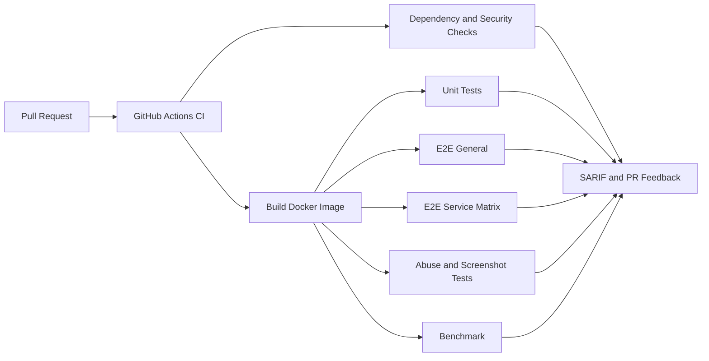

# 03. Is Akislari ve CI/CD Pipeline Analizi

## 3.1 Secilen Pipeline

Derin analiz icin secilen workflow dosyasi:

- [`.github/workflows/ci.yml`](https://github.com/appwrite/appwrite/blob/1.9.x/.github/workflows/ci.yml)

Bu dosya Appwrite reposundaki merkezi kalite kapisidir. `pull_request` ve `workflow_dispatch` event'leriyle tetiklenir. Ayrica `concurrency` kullanarak ayni ref icin eski calismalari iptal eder. Bu, kaynak tuketimini azaltir ve ayni branch icin "en guncel dogru sonuc" prensibini korur.

## 3.2 Pipeline Ne Yapiyor?

Workflow'un ana bloklari:

- `dependencies`: OSV scanner reusable workflow ile bagimlilik kontrolu
- `security`: Docker image ve kaynak kodu Trivy ile tarayip SARIF olarak yukleme
- `composer`: `validate`, `install`, `audit`
- `format`: linter/format kontrolu
- `analyze`: PHPStan statik analiz
- `locale`: locale dogrulama
- `matrix`: hangi veritabani ve mod kombinasyonlarinda test kosulacagini uretme
- `build`: Appwrite Docker image'ini build edip artifact olarak yukleme
- `unit`: unit testler
- `e2e_general`: genel end-to-end testler
- `e2e_service`: servis bazli E2E testler
- `e2e_abuse`: abuse protection aktifken testler
- `e2e_screenshots`: screenshot/special group testleri
- `benchmark`: PR performansini son surumle karsilastirma

## 3.3 Adim Adim Akis

1. PR gelince dependency ve security taramalari calisir.
2. Kod yapisal olarak dogrulanir: Composer, lint, PHPStan, locale.
3. `matrix` job'u, degisiklik tipine gore tam matris veya dar matris test secimi yapar.
4. `build` job'u development hedefli Docker image ureterek artifact'e donusturur.
5. Test job'lari bu image'i indirir, `docker compose up -d --wait` ile stack'i ayaga kaldirir.
6. Unit ve E2E testler farkli servis ve veritabani modlarinda kosar.
7. Basarisizlik durumunda `docker compose logs` alinip hata analizi kolaylastirilir.
8. Benchmark job'u PR performansini mevcut "latest" ile karsilastirip PR yorumuna yazar.

Bu pipeline, sadece "test calisti mi" degil; supply-chain, image guvenligi, kod kalitesi, davranissal regresyon ve performans etkisini ayni yerde toplar.

## 3.4 Neden Onemli?

Appwrite gibi cok servisli bir platformda IDOR/BOLA benzeri hatalar bazen sadece tek bir endpoint'te degil:

- farkli veritabani adapterlerinde,
- farkli authorization modlarinda,
- storage/token/preview gibi farkli resource yollarinda,
- privileged/app/session rolleri arasindaki ayrimlarda

ortaya cikabilir. Bu sebeple Appwrite'in CI tasarimi genis bir matris kullanir. Bu, nesne seviyesinde yetkilendirme hatalarinin tek bir happy-path ile kacmasini zorlastirir.

## 3.5 Webhook Nedir ve Burada Ne Ise Yarar?

GitHub Docs'a gore webhook, bir olay oldugunda dis sisteme otomatik veri gonderen event mekanizmasidir. Polling yerine olay aninda bildirim uretir.

Genel CI/CD baglaminda webhook'in isi:

- push veya PR acildiginda pipeline'i tetiklemek
- deploy, bildirim veya issue senkronu baslatmak
- harici CI sunucusunu uyarmak

Appwrite baglaminda iki farkli webhook anlami vardir:

1. GitHub eventleri, PR/push tabanli otomasyonun kaynagidir.
2. Appwrite'in kendi webhook ozelligi, proje icindeki event'leri harici HTTP endpoint'lere POST eder.

Compose dosyasinda `appwrite-worker-webhooks` adli ayri bir worker olmasi, webhook isinin arka plan isleyici olarak tasarlandigini gosterir. Yani webhook mantigi platform icinde birinci sinif vatandastir.

Kaynaklar:

- [GitHub Docs: About webhooks](https://docs.github.com/articles/creating-webhooks)
- [Appwrite Docs: Webhooks](https://appwrite.io/docs/webhooks)
- [Appwrite CI workflow](https://github.com/appwrite/appwrite/blob/1.9.x/.github/workflows/ci.yml)

## 3.6 Mermaid ile Kisa Gorsel

## 3.7 Bu Adim Icin Sonuc

Appwrite'in CI tasarimi ders konusu icin guclu bir materyal sunuyor. Sadece kodu derleyen degil, image, dependency, kalite, davranis ve performansi birlikte sinayan bir boru hatti var. Bu da repo profesyonelligi beklentisini dogrudan karsiliyor.
