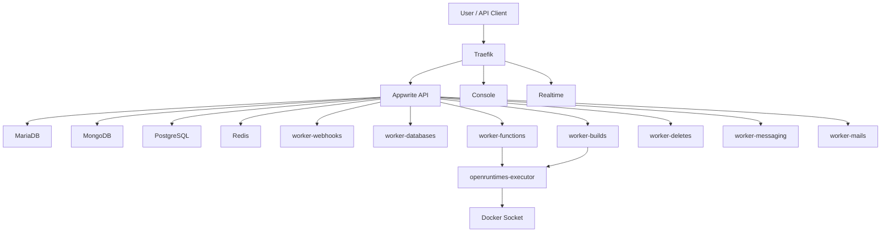

# 04. Docker Mimarisi ve Konteyner Guvenligi

## 4.1 Genel Mimari

Appwrite tek container'lik bir uygulama degil; reverse proxy, ana API, console, realtime, cok sayida background worker, executor, veritabani ve yardimci servislerden olusan mikroservis benzeri bir stack.

Temel gruplar:

- Giris katmani: `traefik`
- Ana uygulama: `appwrite`, `appwrite-console`, `appwrite-realtime`
- Arka plan worker'lari: audits, webhooks, deletes, databases, builds, screenshots, certificates, executions, functions, mails, messaging, migrations, stats
- Runtime/executor: `openruntimes-executor`
- Veri katmani: `mariadb`, `mongodb`, `postgresql`, `redis`
- Yardimci servisler: `coredns`, `ollama`, `maildev`, `request-catcher-*`

## 4.2 Mermaid Diyagram

## 4.3 Guvenlik Acisindan En Kritik Noktalar

### a) Development Compose Production Degil

Compose dosyasi daha ilk satirlarinda bunun gelistirme surumu oldugunu ve production'da kullanilmamasi gerektigini soyluyor. Bu tek basina onemli bir bulgudur.

### b) Docker Socket Mount

En kritik risk `docker.sock` mount'udur. `traefik`, `appwrite` ve ozellikle `openruntimes-executor` bu mount'a erisebilir. Bu, saldiri olursa host container kontrol sinirinin zayiflayabilecegi anlamina gelir.

### c) Acik Portlar

Development stack'te web portlarinin yani sira veritabani portlari da expose edilmistir. Bu, laboratuvar icin kullanisli ama saldiri yuzeyi buyuk bir tercihtir.

### d) Kalici Volume'ler

Uploads, functions, builds, certificates ve DB volume'leri kalicidir. Bu iyi bir operasyonel gereksinimdir; ama adli temizlik ve veri sizintisi acisindan takip ister.

### e) Executor ve Runtime Katmani

Appwrite Functions/Sites mantigi runtime izolasyonu hedeflese de executor katmani Docker altyapisina yaslanir. Bu yuzden "container var, o halde tam izole" demek teknik olarak dogru degildir.

## 4.4 Docker Neden Var?

Docker burada:

- servisleri birbirinden ayirmak,
- tekrar edilebilir kurulum saglamak,
- CI ortaminda ayni stack'i kolay ayaga kaldirmak,
- runtime ve worker sorumluluklarini ayristirmak

icin kullanilir.

## 4.5 Container Guvenligi Kisa Yorumu

Container'lar VM degildir. Isolation vardir ama host cekirdegi ortaktir. Ozellikle su durumlarda risk artar:

- privileged mount kullanimi
- Docker socket erisimi
- gereksiz port yayini
- debug/dev compose'un internete acik kullanimi
- secrets'in `.env` icinde zayif tutulmasi

## 4.6 Kubernetes ve VM ile Fark

### Docker Compose

- Tek host veya kucuk lab icin hizli.
- Operasyonel bariyer dusuk.
- Ama policy, secret isolation ve network segmentation daha zayif/manuel olabilir.

### Kubernetes

- Buyuk olcekte orchestration, policy ve network ayrimi acisindan daha guclu.
- Ama kurulum ve isletim maliyeti yuksektir.

### VM

- Cekirdek seviyesinde daha guclu izolasyon sunar.
- Laboratuvar kurulumlarini silip sifirlamak en kolay yoldur.

Kisa yargi:

Appwrite gelistirme incelemesi icin en mantikli kombinasyon `VM icinde Docker Compose` olur.

## 4.7 Bu Adim Icin Sonuc

Appwrite'in Docker mimarisi modern ve islevsel, fakat guvenlik acisindan "convenience-first" development tercihleri iceriyor. Bu, vize konusuna tam uygundur; cunku bir yandan mikroservis mimarisini gosterirken bir yandan da container guvenliginde rahatlik ile risk arasindaki trade-off'u acikca ortaya koyar.
