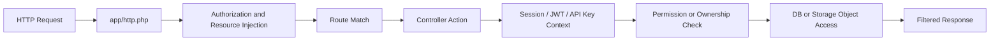

# 05. Kaynak Kod ve Akis Analizi

## 5.1 HTTP Entrypoint

Appwrite'in HTTP giris noktasi:

- [app/http.php](https://github.com/appwrite/appwrite/blob/1.9.x/app/http.php)

Bu dosya:

- Swoole tabanli HTTP server'i baslatir.
- Public dosyalari servis eder.
- Router ve kaynak enjeksiyonunu hazirlar.
- Authorization nesnesini request/response baglamina yerlestirir.
- Request bazli role temizligi ve temel rol yuklemesi yapar.
- Uygun route'a akisi delege eder.

Bu dosya, "uygulamanin neresinden basliyor?" sorusunun ana cevabidir.

## 5.2 CLI Entrypoint

Kurulum ve gorev tarafinda giris noktasi:

- [bin/install](https://github.com/appwrite/appwrite/blob/1.9.x/bin/install)
- [app/cli.php](https://github.com/appwrite/appwrite/blob/1.9.x/app/cli.php)

CLI tarafta da pool, authorization, DB ve worker kaynaklari DI mantigiyla kurulur. Yani HTTP ve task duzlemleri ayri ama ayni platform modelini kullanir.

## 5.3 Authentication Nasil Isliyor?

Resmi Appwrite Auth dokumanina gore session tabanli istemci akisinda kullanici once session olusturur, sonra sadece yetkili oldugu kaynaklara erisebilir. JWT dokumani da backend API'lerin Appwrite uzerinden kullanici adina hareket ederken permission modelini bozmamasi gerektigini acikca vurgular.

Kaynaklar:

- [Authentication docs](https://appwrite.io/docs/advanced/security/authentication)
- [JWT login docs](https://appwrite.io/docs/products/auth/jwt)
- [Accounts docs](https://appwrite.io/docs/products/auth/accounts)

Kod tarafinda `app/controllers/api/account.php` icindeki session olusturma akisindan cikan ana noktalar:

- Session secret'i DB'ye acik halde degil, hash'lenmis olarak yazilir.
- Session dokumanina `read/update/delete` izinleri kullanicinin kendisine verilir.
- Cookie tabanli oturum kurulumu yapilir.
- Token dogrulama ve session omru proje ayarlarina gore yonetilir.

Bu davranis, kimlik dogrulamanin "sadece giris yaptirma" olmadigini; oturum dokumaninin bile object-level yetki mantigiyla olusturuldugunu gosterir.

## 5.4 Appwrite'da Yetki Mantigi Nasil Calisiyor?

Appwrite'in docs tarafinda cok kritik iki ilke var:

1. Session kullanan istemci API'leri permission'lara tabidir.
2. Server tarafli Users API, session'a degil API key scope'larina tabidir.

Bu ayrim IDOR/BOLA icin cok onemlidir. Cunku gelistirici yanlislikla server yetkisini istemciye acarsa permission modelini by-pass etmis olur.

## 5.5 Kod Icindeki Ownership Kontrolune Ornek

`app/controllers/api/account.php` icinde push target guncelleme ve silme akislarinda, hedef nesnenin mevcut kullaniciya ait olup olmadigi dogrudan kontrol edilir. Akis mantigi su sekildedir:

1. `targetId` ile nesne okunur.
2. Nesne yoksa hata donulur.
3. Mevcut kullanicinin ID'si veya internal sequence bilgisi ile target icindeki owner bilgisi karsilastirilir.
4. Eslesme yoksa "not found" benzeri hata ile akis kesilir.

Bu tip kontrol, klasik ID degistirme saldirilarina karsi cekirdek savunmanin ozudur. Yani sadece `targetId` var diye nesne dondurulmaz; "bu nesne bu kullaniciya ait mi?" sorusu da sorulur.

Ilgili dosya:

- [account.php](https://github.com/appwrite/appwrite/blob/1.9.x/app/controllers/api/account.php)

## 5.6 Permissions Modeli Neden IDOR/BOLA Icin Merkezde?

Appwrite docs tarafinda dosya erisimi icin varsayilan ilke "izin verilmezse erisim yok" seklindedir. Storage permissions dokumani, bucket ve file seviyesinde read/create/update/delete yetkilerinin ayri tanimlandigini ve file security aktifse nesne seviyesinde izin verilebildigini aciklar.

Bu modelin dogal sonucu:

- Guvenli tasarlanirsa BOLA direnci yuksek olur.
- Yanlis tasarlanirsa Appwrite tam da verilen izni uygular ve uygulama katmani IDOR'a acik hale gelir.

Kaynaklar:

- [Storage permissions docs](https://appwrite.io/docs/products/storage/permissions)
- [Accounts docs](https://appwrite.io/docs/products/auth/accounts)

## 5.7 Son Donem Hardening Bulgusu: PR #11553

Inceleme tarihi itibariyle onemli ve guncel bir bulgu var:

- [PR #11553 - Use injected user document for privilege checks](https://github.com/appwrite/appwrite/pull/11553)

Bu PR:

- `2026-03-16` tarihinde acildi
- `2026-03-30` tarihinde merge edildi
- `57` dosyada privilege check mantigini guncelledi

Teknik anlami:

- Statik `User::isPrivileged(...)` ve `User::isApp(...)` kontrolleri yerine request baglamina enjekte edilen gercek `user` nesnesi kullanildi.
- Request ve Response nesneleri, kullanici baglamini daha dogru tasimaya basladi.
- Storage, Databases, Teams ve benzeri modullerde privilege hesaplama baglama daha dogru baglandi.

Bu neden onemli?

Cunku yetki kontrolu ne kadar "gercek request baglamina" yakin yapilirsa, privilege yanlis hesaplama veya baglam sapmasi riski o kadar azalir. BOLA/IDOR savunmasinda bu detay kucuk degil, cok temel bir sertlestirmedir.

## 5.8 Akis Ozeti

## 5.9 Bu Adim Icin Sonuc

Appwrite'in kaynak kodunda IDOR/BOLA savunmasi "gizli ID" yaklasimiyla degil, session baglami, permission modeli, owner kontrolu ve son donemde daha da guclendirilen privilege check yapisiyla kurulmus durumda. Bu, ders konusu acisindan teknik olarak savunulabilir ve kaynakla desteklenebilir bir sonuc verir.
